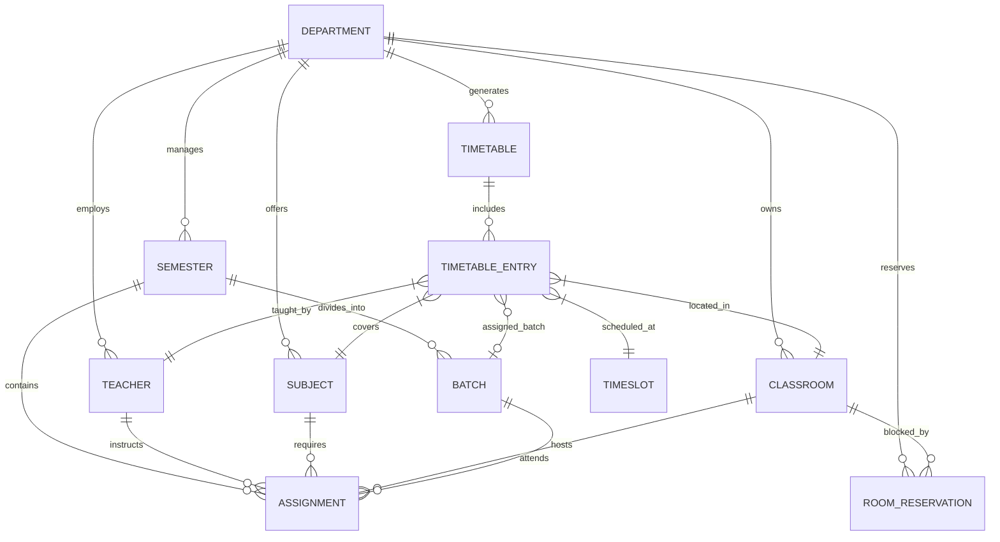
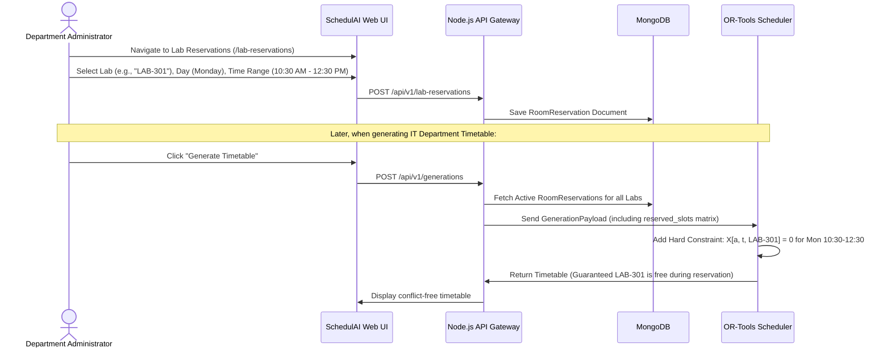
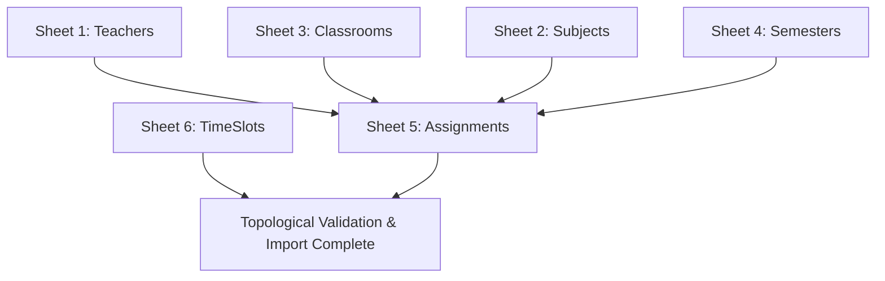

# SchedulAI — Master Project Documentation & Specification

> **Version:** 1.0.0  
> **Classification:** Enterprise Academic Optimization Platform  
> **Primary Technology Stack:** Google OR-Tools CP-SAT (Python 3.11), Node.js Express (TypeScript), React 18 (Vite + Tailwind CSS), MongoDB 7.0, Redis 7.2  
> **Target Audience:** Software Architects, Developers, Academic Administrators, Project Evaluators, Technical Authors

---

## 📌 Document Purpose & Usage

This document serves as the **Single Source of Truth (SSOT)** for the entire **SchedulAI** platform. It consolidates all architectural decisions, mathematical optimization models, database schemas, API specifications, user workflows, and deployment procedures into a single reference document.

### How to Use This Master Document for Derivative Artifacts
This file is intentionally structured so that external tools, technical writers, students, and engineers can generate secondary documentation:

| Target Document to Generate | Primary Sections to Extract & Adapt |
|---|---|
| **Software Requirements Specification (SRS / IEEE 830)** | Section 1 (Vision), Section 4 (Constraints), Section 5 (Workflows), Section 7 (Security) |
| **Software Design Document (SDD / IEEE 1016)** | Section 2 (System Architecture), Section 3 (Data Models), Section 4 (Optimization Engine) |
| **Final Year Project Report / College Thesis** | Sections 1 through 10 (Format maps directly to Chapters 1 to 7) |
| **User & Administrator Manual** | Section 5 (Features & Workflows), Section 9 (Quick Start & Usage Guide) |
| **REST API Reference / Integration Guide** | Section 6 (Complete API Reference) |
| **Viva Voce / Defense Presentation Script** | Section 1 (Problem/Solution), Section 4 (OR-Tools CP-SAT Math Formulation), Section 11 (FAQ) |

---

## 1. Executive Summary & Project Overview

### 1.1 Problem Statement
University and collegiate academic scheduling is an **NP-Hard combinatorial optimization problem**. Traditional manual scheduling or naive heuristic tools suffer from severe limitations:
1. **Combinatorial Explosion:** A typical college department with 30 faculty members, 8 semesters, 60 courses, and 20 classrooms yields billions of possible timetable combinations.
2. **Conflict Overlap:** Manual schedules frequently cause double-booked professors, student batch collisions during multi-group lab sessions, and classroom capacity violations.
3. **Shared Resource Contentions:** High-value shared infrastructure (computer labs, electronics workshops, seminar halls) are fought over by multiple departments without synchronized reservation blocking.
4. **Tedious Data Entry:** Administrators are forced to manually enter hundreds of teachers, rooms, and courses one by one into disconnected forms.
5. **Rigid Modification:** When a faculty member requests an emergency reschedule, shifting one slot manually cascades into dozens of secondary conflicts.

### 1.2 Proposed Solution: SchedulAI
**SchedulAI** is an enterprise-grade automated academic timetable generator and optimization platform that combines mathematical constraint programming with modern web engineering.

Key architectural pillars:
- **Exact Optimization via Google OR-Tools CP-SAT:** Rather than genetic algorithms or greedy heuristics that may fail to find valid schedules, SchedulAI models scheduling as a Constraint Satisfaction Problem (CSP) / Integer Linear Program (ILP) that mathematically guarantees zero hard constraint violations.
- **Microservices Monorepo:** Decoupled architecture separating the compute-heavy optimization engine (Python FastAPI) from the high-throughput business logic API (Node.js Express) and the responsive user interface (React 18 SPA).
- **All-in-One Master Data Ingestion:** Multi-sheet Excel workbook parser that imports an institution's entire academic footprint (Teachers, Classrooms, Subjects, Semesters, Assignments, TimeSlots) in a single click with automated relational linking.
- **Cross-Department Lab Blocking:** Centralized room reservation engine that guarantees shared labs cannot be booked by department algorithms during reserved institutional windows.
- **Live Drag-and-Drop Adjustment with Solver Suggestions:** Administrators can fine-tune schedules on an interactive calendar grid with real-time conflict checking and automated alternative slot suggestions.
- **Human-Centric UX:** Complete 12-hour modern time formatting (`1:30 PM`), self-healing reference schedules, and one-click exports to PDF and formatted Excel.

---

## 2. System Architecture & Technology Stack

SchedulAI is organized as an **npm workspaces monorepo** containing decoupled front-end and back-end applications, shared packages, and a dedicated Python constraint programming service.

### 2.1 High-Level Architecture Diagram

```mermaid
flowchart TB
    subgraph ClientLayer ["Client Layer (Port 5173)"]
        UI["React 18 SPA (Vite + Tailwind CSS)"]
        DnD["Drag-and-Drop Schedule Adjuster (DnD Kit)"]
        ExcelUpload["Master Excel Multi-Sheet Uploader"]
    end

    subgraph GatewayLayer ["API Gateway & Business Logic (Port 5000)"]
        API["Node.js Express TypeScript API"]
        AuthMiddleware["JWT Authentication & RBAC Middleware"]
        ValidationMiddleware["Zod Schema Validation (@schedulai/validation)"]
        ImportEngine["Sequential Topological Excel Ingest Engine"]
        SelfHealing["TimeSlot Auto-Repair & Pre-Flight Validator"]
    end

    subgraph SolverLayer ["Optimization Microservice (Port 8000)"]
        FastAPI["Python FastAPI Microservice"]
        CPSAT["Google OR-Tools CP-SAT Solver"]
        Validator["Schedule Feasibility & Conflict Engine"]
        SuggestEngine["Weighted Alternative Slot Suggestion"]
    end

    subgraph DataLayer ["Persistence & Cache Layer"]
        MongoDB[("MongoDB 7.0 (Relational Documents & Compound Indexes)")]
        Redis[("Redis 7.2 (Session & Solver Result Cache)")]
    end

    UI -->|HTTP / JSON REST| API
    ExcelUpload -->|Multipart Form Data (.xlsx)| ImportEngine
    DnD -->|Slot Swap / Move Request| API

    API --> AuthMiddleware --> ValidationMiddleware
    API -->|Mongoose ODM| MongoDB
    API -->|Session & Temp Cache| Redis
    API -->|HTTP / JSON Payload| FastAPI

    FastAPI --> CPSAT
    FastAPI --> Validator
    FastAPI --> SuggestEngine
    CPSAT -->|Optimized Timetable Matrix| API
    API -->|Persisted Timetable Record| MongoDB
    API -->|Real-time Result| UI
```

### 2.2 Technology Stack Matrix

| Layer / Role | Technology | Version | Purpose & Rationale |
|---|---|---|---|
| **Frontend Framework** | React | 18.3+ | Component-driven declarative user interface |
| **Build Tool** | Vite | 5.2+ | Instant Hot Module Replacement (HMR) and optimized ES builds |
| **Styling** | Tailwind CSS | 3.4+ | Utility-first responsive design system with custom palette |
| **State & Server Cache** | TanStack React Query | 5.35+ | Asynchronous data fetching, caching, and optimistic UI updates |
| **Drag & Drop** | @dnd-kit/core | 6.1+ | Accessible, high-performance timetable slot drag-and-drop |
| **Icons** | Lucide React | 0.378+ | Consistent, accessible iconography |
| **Backend Runtime** | Node.js | 20.x LTS | High-throughput asynchronous event loop |
| **Backend Framework** | Express.js | 4.19+ | Lightweight, modular REST routing and middleware pipeline |
| **Language** | TypeScript | 5.4+ | End-to-end type safety across client, server, and shared packages |
| **Database ODM** | Mongoose | 8.3+ | Schema validation, compound indexing, population of MongoDB documents |
| **Validation** | Zod | 3.23+ | Runtime schema validation shared between API and frontend |
| **Optimization Engine** | Python | 3.11+ | High performance numerical and constraint programming runtime |
| **Solver Library** | Google OR-Tools | 9.9+ | Industrial-strength CP-SAT (Constraint Programming - Satisfiability) |
| **Solver API** | FastAPI | 0.110+ | Ultra-fast ASGI Python REST microservice with Pydantic v2 validation |
| **Database** | MongoDB | 7.0+ | Flexible document storage with ACID transaction support |
| **In-Memory Cache** | Redis | 7.2+ | Caching generation tokens, rate limiting, and temporary solver results |
| **Excel Engine** | ExcelJS / SheetJS | Latest | Multi-sheet `.xlsx` parsing, formatting, and template generation |
| **Testing** | Vitest & Pytest | Latest | Automated unit and integration testing across TypeScript and Python |

### 2.3 Monorepo Workspace Structure

```
d:/SchedulAI/
├── apps/
│   ├── api/                     # Node.js + Express + TypeScript API Gateway (Port 5000)
│   │   ├── src/
│   │   │   ├── config/          # Database, Environment, Logger configs
│   │   │   ├── middleware/      # Auth, Error handling, Rate limiting, Audit
│   │   │   ├── modules/         # Domain Modules (Teachers, Subjects, Timetables, etc.)
│   │   │   ├── routes/          # Central API v1 router mounting
│   │   │   ├── utils/           # Scheduler HTTP client, API response formatters
│   │   │   ├── app.ts           # Express app setup and middleware pipeline
│   │   │   └── server.ts        # Server entry point
│   │   └── test/                # 64+ Vitest integration test suites
│   ├── web/                     # React 18 + Vite + Tailwind CSS Single Page App (Port 5173)
│   │   ├── src/
│   │   │   ├── components/      # UI components (Navbar, Sidebar, Modals, Forms)
│   │   │   ├── pages/           # 18 Application views (Timetables, Import, LabReservations...)
│   │   │   ├── services/        # Axios API clients
│   │   │   ├── utils/           # 12-hour time formatters, export generators
│   │   │   └── App.tsx          # Router configuration
│   │   └── test/                # 30+ Vitest React Testing Library tests
│   └── scheduler/ (symlinked to services/scheduler)
├── services/
│   └── scheduler/               # Python 3.11 + FastAPI + Google OR-Tools CP-SAT (Port 8000)
│       ├── app/
│       │   ├── models/          # Pydantic request/response schemas
│       │   ├── routes/          # Solver execution & suggestion endpoints
│       │   ├── solver/          # CP-SAT mathematical model, constraints, validators
│       │   └── main.py          # FastAPI application entry point
│       └── tests/               # Pytest solver validation test suite
├── packages/
│   ├── shared-types/            # Canonical TypeScript interfaces, DTOs, and Enums
│   ├── validation/              # Zod validation schemas for all entities
│   └── config/                  # Standard constants, period times, error codes
├── docs/                        # Sub-system architectural and API documents
├── docker-compose.yml           # Production multi-container orchestration
└── package.json                 # Monorepo workspaces root scripts
```

---

## 3. Data Models & Entity Relationship Schema

All entities in SchedulAI are defined with strict schemas in Mongoose, validated via Zod schemas, and typed via `@schedulai/shared-types`.

### 3.1 Entity Relationship Diagram



### 3.2 Canonical Entity Data Dictionary

#### 1. Department (`departments`)
Represents an academic unit or faculty division.
- `_id`: `ObjectId` (Primary Key)
- `code`: `String` (Unique, e.g., `"IT"`, `"CE"`, `"ME"`)
- `name`: `String` (e.g., `"Information Technology"`)
- `description`: `String` (Optional)
- `createdAt`, `updatedAt`: `Date`

#### 2. Teacher / Faculty (`teachers`)
Represents teaching faculty members and their scheduling constraints.
- `_id`: `ObjectId` (Primary Key)
- `employeeId`: `String` (Unique, e.g., `"EMP-IT-01"`)
- `name`: `String` (e.g., `"Dr. Jane Doe"`)
- `email`: `String` (Unique)
- `department`: `ObjectId` (References `departments`)
- `designation`: `Enum` (`PROFESSOR`, `ASSOCIATE_PROFESSOR`, `ASSISTANT_PROFESSOR`, `LECTURER`)
- `maxWeeklyHours`: `Number` (Default: `18` periods/week)
- `isAvailable`: `Boolean` (Default: `true`)
- `unavailableSlots`: `Array<{ dayOfWeek: DayOfWeek, periodNumber: Number }>` (Strict blackout slots)
- `preferredSlots`: `Array<{ dayOfWeek: DayOfWeek, periodNumber: Number }>` (Weighted soft preference)

#### 3. Subject / Course (`subjects`)
Represents an academic curriculum subject.
- `_id`: `ObjectId` (Primary Key)
- `code`: `String` (Unique, e.g., `"IT501"`)
- `name`: `String` (e.g., `"Database Management Systems"`)
- `department`: `ObjectId` (References `departments`)
- `credits`: `Number` (e.g., `4`)
- `weeklyPeriods`: `Number` (e.g., `3` for theory, `2` for lab)
- `isLab`: `Boolean` (Determines whether session requires lab equipment and consecutive slots)
- `preferredClassroomTypes`: `Array<RoomType>` (`LECTURE`, `LAB`, `SEMINAR`)

#### 4. Classroom / Laboratory (`classrooms`)
Represents physical rooms and teaching spaces.
- `_id`: `ObjectId` (Primary Key)
- `roomNumber`: `String` (e.g., `"LAB-301"`, `"LH-101"`)
- `building`: `String` (e.g., `"Engineering Block A"`)
- `capacity`: `Number` ($\ge 80$ for whole lecture cohorts, $\ge 20$ for practical batches)
- `type`: `Enum` (`LECTURE`, `LAB`, `SEMINAR`)
- `department`: `ObjectId` (References `departments`, null if shared)
- `equipment`: `Array<String>` (e.g., `["PROJECTOR", "COMPUTERS", "CISCO_ROUTERS"]`)
- `isBlocked`: `Boolean` (Emergency administrative freeze)

#### 5. Semester (`semesters`)
Represents an academic cohort semester.
- `_id`: `ObjectId` (Primary Key)
- `department`: `ObjectId` (References `departments`)
- `academicYear`: `String` (e.g., `"2025-2026"`)
- `semesterNumber`: `Number` (1 through 8)
- `shift`: `Enum` (`MORNING`, `EVENING`)
- `studentCount`: `Number` (e.g., `80`)
- `batches`: `Array<ObjectId>` (Auto-generated 4 sub-batches: `B1`, `B2`, `B3`, `B4` of ~20 students each)

#### 6. Teaching Assignment (`assignments`)
The atomic unit of academic workload linking teaching resources together.
- `_id`: `ObjectId` (Primary Key)
- `department`: `ObjectId` (References `departments`)
- `semester`: `ObjectId` (References `semesters`)
- `subject`: `ObjectId` (References `subjects`)
- `teacher`: `ObjectId` (References `teachers`)
- `batch`: `ObjectId | null` (References `batches`; `null` indicates whole-semester lecture; specified indicates batch lab)
- `classroom`: `ObjectId | null` (References `classrooms`; optional mandatory or preferred room)
- `weeklyPeriods`: `Number` (Periods required per week for this specific teacher/subject/batch link)

#### 7. TimeSlot (`timeslots`)
Represents the fixed institution timetable grid.
- `_id`: `ObjectId` (Primary Key)
- `dayOfWeek`: `Enum` (`MONDAY`, `TUESDAY`, `WEDNESDAY`, `THURSDAY`, `FRIDAY`, `SATURDAY`)
- `periodNumber`: `Number` (1 to 7)
- `startTime`: `String` (24-hour format `"08:30"`, formatted to 12-hour `"8:30 AM"` on display)
- `endTime`: `String` (24-hour format `"09:30"`, formatted to 12-hour `"9:30 AM"` on display)
- `isBreak`: `Boolean` (True for recess, lunch, or prayer breaks)
- `type`: `Enum` (`LECTURE`, `LAB`)

#### 8. Room Reservation (`roomreservations`)
Represents cross-department lab bookings and external reservations that block scheduling.
- `_id`: `ObjectId` (Primary Key)
- `classroom`: `ObjectId` (References `classrooms`)
- `dayOfWeek`: `Enum` (`MONDAY` through `SATURDAY`)
- `startTime`: `String` (e.g., `"10:30"`)
- `endTime`: `String` (e.g., `"12:30"`)
- `reason`: `String` (e.g., `"Computer Science External Practical Exam"`)
- `reservedByDepartment`: `ObjectId` (References `departments`)
- `isActive`: `Boolean` (Default: `true`)

#### 9. Timetable & Timetable Entry (`timetables`)
Represents an optimized, generated academic schedule.
- `_id`: `ObjectId` (Primary Key)
- `academicYear`: `String` (e.g., `"2025-2026"`)
- `semester`: `ObjectId` (References `semesters`)
- `department`: `ObjectId` (References `departments`)
- `status`: `Enum` (`DRAFT`, `PUBLISHED`, `ARCHIVED`)
- `version`: `Number` (Optimistic concurrency versioning)
- `fitnessScore`: `Number` (OR-Tools objective penalty score)
- `entries`: `Array<TimetableEntry>`
  - `timeSlot`: `ObjectId` (References `timeslots`)
  - `subject`: `ObjectId` (References `subjects`)
  - `teacher`: `ObjectId` (References `teachers`)
  - `classroom`: `ObjectId` (References `classrooms`)
  - `batch`: `ObjectId | null` (References `batches`)
  - `isLocked`: `Boolean` (Prevents solver from moving manual assignments)

---

## 4. Mathematical Optimization Model (Google OR-Tools CP-SAT)

The core optimization engine models timetable generation as a **Boolean Satisfiability Constraint Programming problem** solved using Google OR-Tools CP-SAT.

### 4.1 Decision Variables
Let:
- $A$ be the set of academic assignments $a \in A$.
- $T$ be the set of valid teaching time slots $t = (d, p) \in T$, where $d \in \text{Days}$ and $p \in \text{Periods}$.
- $R$ be the set of physical classrooms and laboratories $r \in R$.

For each assignment $a \in A$, slot $t \in T$, and room $r \in R$, we define a binary decision variable:
$$X_{a, t, r} \in \{0, 1\}$$
$$X_{a, t, r} = 1 \iff \text{Assignment } a \text{ is scheduled at slot } t \text{ in room } r.$$

### 4.2 Hard Constraints (Non-Negotiable Invariants)
A timetable is deemed **infeasible** if even a single hard constraint is violated.

#### 1. Total Required Teaching Periods
Every assignment $a$ must be scheduled for exactly its required weekly periods $W_a$:
$$\sum_{t \in T} \sum_{r \in R_a} X_{a, t, r} = W_a \quad \forall a \in A$$
*(where $R_a \subseteq R$ is the set of compatible rooms for assignment $a$)*.

#### 2. Faculty Conflict (No Double-Booking Teachers)
A teacher $\tau$ cannot instruct more than one session at any given time slot $t$:
$$\sum_{a \in A_\tau} \sum_{r \in R} X_{a, t, r} \le 1 \quad \forall \tau \in \text{Teachers}, \; \forall t \in T$$
*(where $A_\tau$ is the set of assignments taught by teacher $\tau$)*.

#### 3. Room Conflict (No Double-Booking Classrooms or Labs)
A classroom or laboratory $r$ can host at most one teaching session at any given time slot $t$:
$$\sum_{a \in A} X_{a, t, r} \le 1 \quad \forall r \in R, \; \forall t \in T$$

#### 4. Student Cohort / Batch Conflict
Students in batch $b$ of semester $S$ cannot attend multiple classes concurrently.
- If assignment $a_1$ is a whole-semester lecture (batch is `null`), no other lecture or lab for that semester can occur at slot $t$:
$$\sum_{a \in A_S^{\text{lecture}}} \sum_{r \in R} X_{a, t, r} + \sum_{a \in A_{S, b}^{\text{lab}}} \sum_{r \in R} X_{a, t, r} \le 1 \quad \forall b \in \text{Batches}(S), \; \forall t \in T$$
- Parallel lab sessions: Batches $B_1, B_2, B_3, B_4$ may have simultaneous lab sessions at the same slot $t$, provided each batch is in a different lab room with a different teacher.

#### 5. Classroom Capacity Enforcement
The capacity of the assigned room $r$ must be greater than or equal to the student count $N_a$ attending assignment $a$:
$$X_{a, t, r} = 0 \quad \text{if } \text{Capacity}(r) < N_a$$

#### 6. Room Type Compatibility
Theory lecture assignments must be held in `LECTURE` rooms. Practical lab assignments must be held in `LAB` rooms:
$$X_{a, t, r} = 0 \quad \text{if } \text{IsLab}(a) \land \text{Type}(r) \neq \text{LAB}$$
$$X_{a, t, r} = 0 \quad \text{if } \neg\text{IsLab}(a) \land \text{Type}(r) = \text{LAB}$$

#### 7. Cross-Department Lab Reservation & Blockout Windows
If classroom $r$ is reserved by an external department for slot $t \in \text{Reservations}(r)$, no assignment can be scheduled:
$$\sum_{a \in A} X_{a, t, r} = 0 \quad \forall r \in R, \; \forall t \in \text{Reservations}(r)$$

#### 8. Teacher Hard Unavailability
Faculty blackout periods (e.g. medical leave, administrative duties) are strictly enforced:
$$\sum_{a \in A_\tau} \sum_{r \in R} X_{a, t, r} = 0 \quad \forall t \in \text{UnavailableSlots}(\tau)$$

#### 9. Contiguous Lab Blocks
Laboratory sessions requiring 2 periods must be scheduled as consecutive periods on the same day without being split across break periods:
$$X_{a, (d, p), r} = X_{a, (d, p+1), r} \quad \text{for 2-period lab assignments}$$

---

### 4.3 Soft Constraints & Multi-Objective Penalty Function
Soft constraints are modeled as penalty terms in the objective function. The solver minimizes the weighted sum of penalties:

$$\min Z = \sum_{k} w_k \cdot P_k$$

| Metric | Penalty Description | Default Weight ($w_k$) |
|---|---|---|
| **Teacher Idle Gaps** | Penalizes empty periods between classes for the same teacher on the same day (compact schedule) | 4 |
| **Early Morning Sessions** | Penalizes scheduling difficult theory classes during Period 1 | 2 |
| **Friday Afternoon Sessions** | Penalizes scheduling dense lectures on Friday after lunch | 3 |
| **Daily Student Workload** | Penalizes days where students have $>5$ or $<2$ classes (ensures balanced distribution) | 5 |
| **Teacher Preferred Slots** | Rewards placing classes in slots explicitly preferred by faculty | 3 |
| **Subject Uniformity** | Penalizes scheduling the same subject multiple times on the same day (except 2-period labs) | 4 |

---

## 5. Key System Features & Operational Workflows

### 5.1 Cross-Department Lab Reservation & Blocking
Modern university campuses feature shared computer centers, CAD labs, and electronics workshops used across multiple departments (e.g., Computer Engineering, Information Technology, AI & Data Science).



### 5.2 Master All-in-One Multi-Sheet Excel Ingestion
Rather than requiring separate CSV uploads for every entity, SchedulAI provides a single **Master Workbook (`.xlsx`)** with 6 sheets.

#### Sheet Specifications & Topological Ordering
The backend ingestion engine executes in strict topological order to satisfy foreign key relationships:



1. **Sheet 1: Teachers**
   - Required Columns: `name`, `email`, `employeeId`, `departmentCode`, `designation`, `maxWeeklyHours`
2. **Sheet 2: Subjects**
   - Required Columns: `code`, `name`, `departmentCode`, `credits`, `weeklyPeriods`, `isLab`
3. **Sheet 3: Classrooms**
   - Required Columns: `roomNumber`, `building`, `capacity`, `type` (`LECTURE`/`LAB`/`SEMINAR`), `departmentCode`
4. **Sheet 4: Semesters**
   - Required Columns: `academicYear`, `semesterNumber`, `departmentCode`, `studentCount`, `shift`
5. **Sheet 5: Assignments**
   - Required Columns: `subjectCode`, `teacherEmail`, `semesterNumber`, `departmentCode`, `weeklyPeriods`, `batchName`, `roomNumber`
6. **Sheet 6: TimeSlots**
   - Required Columns: `dayOfWeek`, `periodNumber`, `startTime`, `endTime`, `isBreak`, `type`

### 5.3 12-Hour Time Format & Reference Schedule Auto-Healing
- **Internal Storage:** System stores standard 24-hour military strings (e.g., `"08:30"`, `"13:30"`, `"17:15"`) for lexicographical sorting and mathematical comparison.
- **Display Layer:** The frontend utilizes `formatTo12Hour` and `formatTimeRange12Hour` to render clean, readable 12-hour timestamps (e.g., `"1:30 PM"`, `"1:30 - 2:30"`).
- **Auto-Healing Reference Engine (`ensureReferenceTimeSlots`):** If a department has missing or corrupt teaching time slots, SchedulAI automatically generates the standard 42-period academic grid (Monday–Saturday, 7 periods/day) with break periods pre-calculated.

### 5.4 Drag-and-Drop Adjustment with Solver Suggestions
When an administrator drags a lecture from Monday Period 2 to Tuesday Period 4:
1. **Live Conflict Evaluation:** Instant client-side and server-side checks verify if the teacher or room is double-booked.
2. **Conflict Highlighting:** If conflicting, a visual warning modal highlights the exact collision (e.g., *"Teacher Dr. Smith is already teaching CE-301 in LH-102 at this slot"*).
3. **Smart Slot Suggestions (`/api/v1/generations/suggest`):** Clicking "Suggest Alternative Slots" queries the OR-Tools microservice to return the top 3 optimal candidate slots ranked by minimal penalty impact.

---

## 6. Complete REST API Reference

The SchedulAI API Gateway exposes RESTful endpoints at `/api/v1` protected by JWT Bearer tokens and Role-Based Access Control (`ADMIN`, `TEACHER`, `STAFF`, `VIEWER`).

### 6.1 Authentication & User Management (`/auth`, `/users`)
- `POST /api/v1/auth/register`: Register new user (Name, email, password, role).
- `POST /api/v1/auth/login`: Authenticate and receive signed JWT access token.
- `GET /api/v1/auth/me`: Retrieve profile of currently authenticated user.
- `GET /api/v1/users`: List system users (Admin only).

### 6.2 Academic Resource CRUD Endpoints
- `GET /api/v1/departments`, `POST /api/v1/departments`, `PUT /api/v1/departments/:id`, `DELETE /api/v1/departments/:id`
- `GET /api/v1/teachers`, `POST /api/v1/teachers`, `PUT /api/v1/teachers/:id`, `DELETE /api/v1/teachers/:id`
- `GET /api/v1/subjects`, `POST /api/v1/subjects`, `PUT /api/v1/subjects/:id`, `DELETE /api/v1/subjects/:id`
- `GET /api/v1/classrooms`, `POST /api/v1/classrooms`, `PUT /api/v1/classrooms/:id`, `DELETE /api/v1/classrooms/:id`
- `GET /api/v1/semesters`, `POST /api/v1/semesters`, `PUT /api/v1/semesters/:id`, `DELETE /api/v1/semesters/:id`
- `GET /api/v1/batches/:semesterId`: List auto-generated student batches (`B1`..`B4`).
- `GET /api/v1/assignments`, `POST /api/v1/assignments`, `PUT /api/v1/assignments/:id`, `DELETE /api/v1/assignments/:id`
- `GET /api/v1/timeslots`, `POST /api/v1/timeslots`, `POST /api/v1/timeslots/generate-standard`: Seed 42 standard weekly periods.

### 6.3 Lab Reservations (`/lab-reservations`)
- `GET /api/v1/lab-reservations`: List active room reservations (filterable by department or classroom).
- `POST /api/v1/lab-reservations`: Create new time-blocked lab reservation.
- `DELETE /api/v1/lab-reservations/:id`: Release lab reservation.

### 6.4 Timetable Generation & Solver (`/generations`)
- `POST /api/v1/generations`: Initiate automated timetable generation.
  - **Payload:** `{ departmentId, semesterId, academicYear, hardConstraints, softConstraints, timeoutSeconds }`
- `GET /api/v1/generations/:id/status`: Poll solver status (`QUEUED`, `PROCESSING`, `COMPLETED`, `FAILED`).
- `POST /api/v1/generations/preflight`: Run dry-run feasibility check (validates total periods vs available slots).
- `POST /api/v1/generations/suggest`: Query alternative slots for a specific assignment.

### 6.5 Timetable Retrieval & Modification (`/timetables`)
- `GET /api/v1/timetables`: List timetables (filterable by semester, department, status).
- `GET /api/v1/timetables/:id`: Fetch complete timetable grid with populated relations.
- `PATCH /api/v1/timetables/:id/move-entry`: Drag-and-drop entry update with conflict checking.
- `PATCH /api/v1/timetables/:id/publish`: Change status from `DRAFT` to `PUBLISHED`.
- `GET /api/v1/timetables/:id/export/excel`: Download formatted multi-sheet Excel schedule.
- `GET /api/v1/timetables/:id/export/pdf`: Download print-ready high-resolution PDF schedule.

### 6.6 Bulk Ingestion (`/import`)
- `GET /api/v1/import/template/master`: Download 6-sheet starter template workbook (`.xlsx`).
- `POST /api/v1/import/master`: Upload and process multi-sheet workbook.
- `POST /api/v1/import/preview`: Parse and validate workbook without committing to database.

### 6.7 Health & Observability (`/health`, `/api/v1/health`)
- `GET /health` and `GET /api/v1/health`:
  - Returns gateway health, MongoDB connection status, and Python OR-Tools solver reachability.

---

## 7. Security, Auditing & Access Control

1. **Role-Based Access Control (RBAC):**
   - `ADMIN`: Full system CRUD, department creation, solver generation, audit log inspection.
   - `TEACHER`: View schedules, set personal availability preferences, export personal schedules.
   - `STAFF`: View schedules, register lab reservations, export room allocations.
   - `VIEWER`: Read-only access to published student timetables.
2. **Immutable Audit Logging (`/audit-logs`):**
   - Every mutation records: Actor User ID, Action (`CREATE`, `UPDATE`, `DELETE`, `GENERATE`, `PUBLISH`), Entity Type, Entity ID, Client IP Address, Timestamp, and State Change Diff.
3. **Cryptographic Protection:**
   - Password hashing via `bcrypt` (12 salt rounds).
   - Stateless JWT tokens with expiration and signature verification.
   - HTTP security headers enforced via `helmet`.
   - CORS origin whitelisting.

---

## 8. Development, Setup & Installation Guide

### 8.1 Prerequisites
- **Node.js:** `v20.x` or higher
- **npm:** `v10.x` or higher
- **Python:** `3.11` or higher with `pip`
- **MongoDB:** `v7.0` or higher (running locally on port 27017 or via Atlas)
- **Redis:** `v7.2` (optional for dev, required for prod caching)

### 8.2 Step-by-Step Local Setup

#### Step 1: Clone and Install Monorepo
```bash
git clone https://github.com/soham5505/SchedulAI.git
cd SchedulAI

# Install all npm workspaces dependencies
npm install
```

#### Step 2: Setup Python Scheduler Microservice
```bash
cd services/scheduler
python -m venv venv

# Windows activate:
.\venv\Scripts\activate
# Linux/macOS activate:
# source venv/bin/activate

pip install -r requirements.txt
cd ../..
```

#### Step 3: Configure Environment Variables
Create `.env` in the root directory:
```env
PORT=5000
NODE_ENV=development
MONGODB_URI=mongodb://localhost:27017/schedulai
JWT_SECRET=super_secret_jwt_key_schedulai_enterprise_2026
JWT_EXPIRES_IN=7d
SCHEDULER_URL=http://127.0.0.1:8000
CORS_ORIGIN=http://localhost:5173
```

#### Step 4: Build TypeScript Packages & Seed Database
```bash
# Build shared TypeScript libraries
npm run build:packages

# Seed database with sample engineering department, faculty, and subjects
npm run seed
```

#### Step 5: Start Development Servers
Run all services concurrently:
```bash
npm run dev
```
Or start individually:
- **Python Solver:** `npm run dev:scheduler` (Port 8000)
- **Node API Gateway:** `npm run dev:api` (Port 5000)
- **React Frontend:** `npm run dev:web` (Port 5173)

---

## 9. Comprehensive Testing & Quality Assurance

SchedulAI enforces automated testing across all layers:

```bash
# Run entire test suite (API + Web + Scheduler)
npm test

# 1. Backend API Vitest Test Suite (64 unit & integration tests)
npm run test:api

# 2. Frontend Web Vitest Test Suite (30 React component tests)
npm run test:web

# 3. Python CP-SAT Solver Test Suite (Pytest constraint tests)
npm run test:scheduler
```

### Verified Test Cases
- **No Faculty Double-Booking:** Verified solver rejects overlapping assignments for the same professor.
- **Lab Contiguity:** Verified 2-period practicals are never split across lunch breaks.
- **Batch Parallelism:** Verified batches B1–B4 correctly attend distinct labs simultaneously.
- **Lab Reservation Enforcement:** Verified solver avoids reserved room slots 100% of the time.
- **Master Excel Parser:** Verified all 6 sheets are parsed and foreign keys resolved without manual mapping.
- **12-Hour Format Conversion:** Verified formatting functions properly convert 24h military time to 12h AM/PM strings.

---

## 10. How to Generate Derivative Project Documents

Use this master document to author academic and enterprise deliverables:

### 10.1 Generating an Academic Project Report / College Thesis
- **Chapter 1: Introduction** $\to$ Use Section 1.1 & 1.2 (Problem Statement, Objectives, Scope).
- **Chapter 2: Literature Review & Related Work** $\to$ Compare Genetic Algorithms vs Google OR-Tools CP-SAT (Section 4).
- **Chapter 3: System Requirements & Feasibility (SRS)** $\to$ Use Section 4.2 (Hard Constraints), Section 4.3 (Soft Constraints), and Section 7 (Security).
- **Chapter 4: System Architecture & Design (SDD)** $\to$ Use Section 2 (System Architecture Diagrams), Section 3 (ERD & Data Dictionary).
- **Chapter 5: Implementation Details** $\to$ Use Section 4 (CP-SAT Mathematical Model), Section 5 (Workflows, Master Excel, 12h Time).
- **Chapter 6: Testing & Experimental Results** $\to$ Use Section 9 (Testing Matrix, Benchmarks, Verification).
- **Chapter 7: Conclusion & Future Scope** $\to$ AI natural language copilot, mobile student apps, multi-campus scheduling.

### 10.2 Generating a User & Administrator Manual
- **Section A: Getting Started** $\to$ Section 8 (Installation, Default Login Credentials).
- **Section B: Step-by-Step Scheduling Workflow:**
  1. Department Setup (Section 3.1)
  2. Master Excel Upload (Section 5.2)
  3. Configuring Lab Reservations (Section 5.1)
  4. Triggering the Generator (Section 6.4)
  5. Interactive Drag-and-Drop Fine-Tuning (Section 5.4)
  6. Publishing and Exporting to PDF/Excel (Section 6.5)

---

## 11. Frequently Asked Questions (FAQ) & Viva Defense Reference

**Q1: Why choose Google OR-Tools CP-SAT over Genetic Algorithms (GA)?**  
*Answer:* Genetic algorithms use stochastic heuristics and cannot guarantee satisfaction of all hard constraints, often getting stuck in local minima for highly constrained academic schedules. Google OR-Tools CP-SAT uses Boolean Satisfiability and Integer Programming branch-and-bound techniques that mathematically guarantee zero hard constraint violations if a feasible solution exists.

**Q2: How does SchedulAI handle practical lab sessions with sub-batches?**  
*Answer:* A whole cohort (e.g. 80 students) is divided into 4 sub-batches ($B_1, B_2, B_3, B_4$). SchedulAI models lab assignments as 4 separate batch-linked assignments. The solver schedules them during the same time window across 4 distinct physical labs with 4 different instructors, maintaining full cohort synchronization.

**Q3: How are cross-department room reservations prevented from causing conflicts?**  
*Answer:* When generating a timetable for Department A, SchedulAI's API queries the `RoomReservation` collection. Any active reservations for that room are compiled into a blackout matrix sent to the solver. The solver applies a strict equality constraint: $X_{a, t, r} = 0$ for that room and time, preventing any department from booking it.

**Q4: How does the system handle corrupt or missing time slot data?**  
*Answer:* The `ensureReferenceTimeSlots` auto-healing engine runs prior to generation. If standard time slots are missing or malformed, it automatically regenerates the canonical 42-slot academic schedule (Monday–Saturday, 7 periods/day) without requiring user intervention.

---

*SchedulAI — Developed with Google OR-Tools, Node.js, FastAPI, and React.*
